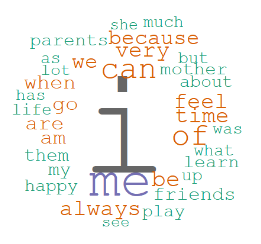
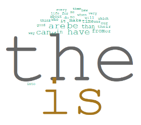
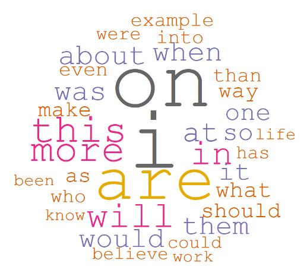
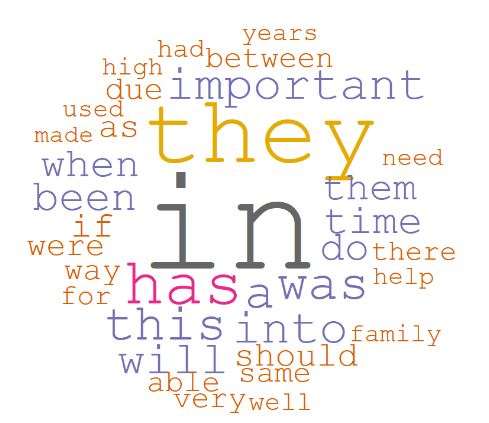
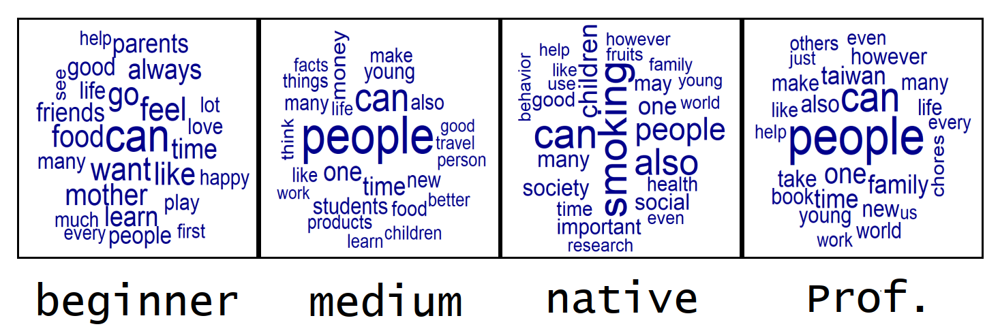

# VSMgrader_DataScienceWithR
Final project of R, an English essay scorer.

## dataset:
- my essay (ranked as medium)
- sample essay from college essay exam
- https://github.com/ChiragSoni95/Autograder (use dataset only)
- http://toefl.zhan.com/
- http://irma0302.pixnet.net/
- https://www.ukessays.com/
- https://drive.google.com/drive/folders/0BxEC0dgV3WQQNHBUZzREQTZUQ3M?fbclid=IwAR2oWP_17pbs4vuKLCCzHefcNARNE4iNR2x6iDnwAuOmiITZx4ULBvhuHMc

Totally 312 essays are collected in our dataset. Including:
* 100 beginner essays (the essays of elementary school students from China)
* 43 medium essays (My essays)
* 109 professional (excellent essays from Taiwanese students, which usually gets great score.)
* 60 native_essays (essays from native english speakers)

## structure:
```
├── data
│   ├── professional
│   ├── medium
│   ├── beginner
│   ├── native 
│   └── dictionary  
├── preprocessing.py
├── vsm.py
├── vsm_v2.py
├── README.md
└── Statics (not yet)
```

## Work
- [vsm model](#vsm)
- [essay eye](#ee)
- [words in document frequency](#df)
- the comparsion of prep.
- Article richness
- [word cloud (without frequency words)](#wc)
- naive model
- average sentence length
- usage of mark
- [average word length](#avgwordlen)

<h3 id="vsm"> VSM model </h3>

#### preprocessing.py
We can clean the data into csv file which record words frequency in essay and the probability of word appearance among files.
The result will save under the diretory /data/dictionary/.
The data had bulit. If new essaies are added, you will better execute the python file angin to ensure the accuary.
```
python3 preprocessing.py
```

#### vsm.py & vsm_v2.py

Use vector space model to evaluate the relationship of the query and per section.

tf: the frequency of the word in an essay, which signifies the importance of the words in the essay.
<br>
idf: inverted document frequency. The larger the number is, the less impoertant does the word means.
```shell=
python3 vsm.py

or

python3 vsm_v2.py
```
It will estimate the essay in query.txt and return the result.

#### Result
The expected output maybe this for the biginner writer.
```
|======= English Level =======|
|                             |
|  beginner:     45.534302 %  |
|  medium:       13.673424 %  |
|  professional: 30.480181 %  |
|  native:       10.312093 %  |
|                             |
|=============================|

```

<h3 id="ee">  essay eye </h3>

#### essay_eye.py
Essay_eye look forword to find the eye word in an essay. It shares same preprocessing file with vsm and it will output 5 candidates eye words after teading the essay in query.txt. You can use python3 to run essay_eye.
```
python3 essay_eye.py
```

<h3 id="df"> words in document frequency </h3>
This section shows the statics of the a word appears in differnet essays. We discuss the word usage in 4 groups. We make a hypothesis that the lower degree english user may repeatedly use the same words among different essays due to their lacking vocabulary. R wordcloud is used to demostrate. 

#### Implementation
To estimate the most important word in an essay. We prepare two versions of tool.
R is used to represent the word cloud. We only choose the top 35 frequency words drawing in the plot.

```r=
beginner_dat = read.csv("XXX.csv", header = F) # the path of idf_rank
beginner_dat <- head(beginner_dat, 35)	# pick top 35v frequency words
library(wordcloud)						# word cloud
wordcloud(								
  words = beginner_dat$V1, 
  freq =  beginner_dat$V2, 
  scale = c(8,.10), 
  random.order = FALSE,
  ordered.colors = FALSE,
  rot.per = FALSE,
  #min.freq = 7,
  colors = brewer.pal(8,"Dark2"),
  family = "mono", 
  font = 10
)
```
Reference: https://ithelp.ithome.com.tw/articles/10192052

#### Result

- beginner: 
It is not a suprising answer to see such figure. **I** is the most popular word in beginner english. They practice writing by diary-like essay. The freqence of relative words prove the phenomenon



- medium:
The result of medium level write is intriguing. By knowing advanced grammar they always remember to put **the** before nouns, and they start to descript objectively by using **is**.



- professional:
For professional writer, they use various words make the essay looks vivid. No specific word dominates although **in** seems has highly fequency owning to the wanting amount of essays we use.



- native:
Our dataset contains the native writer in every generation and every type of essay. As same as professional write, they use various words to present the topic in diverse essays.



 
- [ ] the comparsion of prep.
- [ ] Article richness

<h3 id="wc"> word cloud (without frequency words) </h3>

#### Implementation

#### Result

At first, obviously, after we remove all the function word, **can** becomes the most popular words in every english writers. easy verbs tend to be the most frequency words in the beginner level while nouns usually repeatedly appear in other levels.



- [ ] naive model
- [ ] vsm model
- [ ] average sentence length
- [ ] usage of mark

<h3 id="avgwordlen"> average word length </h3>
We compare the avg word length test whether there is a positive relationship between avg word length writer degree.

#### Implementation

Initially, we use str_split the split the word by space. 
```r=
library(stringr)
bagofprof <- str_split(prof$text[1:109], " ")
```

Then, We cacluate the word length via package magicfor
```r=
magic_for(print, silent = T)
for (i in 1:99){
  avg_word_length <- mean(nchar(bagofbeginner[[i]]))
  print(avg_word_length)
}
(beginnerwl <- magic_result_as_dataframe())
```

#### Result

The result show as below.


The higher level the writer is, the more longer average words length ther will use. Of course this statics may vulnerable to the topic of essay. The result can be more powerful if we can get all the data with the same topic. 


